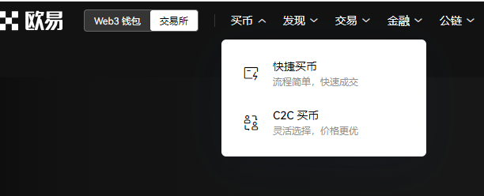

# **从欧易账户给 depay 钱包账户充值转账教程**

注：此教程为欧易账户转账到 depay 钱包万事达卡片的全保姆教程

哪些人用的到？
充值 openAI api 接口账户的同学们。

一，准备工作：

1.再开始之前，你必须要保证你已经开通了一个欧易的账户，并且验证通过的正常账户，类似这样子，如果还没有的，可以先去注册一波，很简单，傻瓜式操作，很基本，

二，充值过程：

1.在欧易上面给你的账户里面买一些 USDT，按需购买

买币的过程，我也就不演示了，就是跟着步骤走就行了，很基础哈，买完币之后，到资产管理

点击提币,选择要提的币种好方式，按照我的走就行，

接下啦，填写对相应的提币的信息，注意这 USDT 地址域名就是你 USDT 的账户地址，继续下一步，

然后知道风险，过！

此时你会看到验证信息，验证完成之后确认，

确认之后，你就能看到交易详情里面就有这些信息，巴拉巴拉。

3.查看转账详情（注意，这里转账不是实时到账，有十分钟左右的延时情况，请耐心等待一下。）来到 depay 钱包，

|  |  |
| ------------------ | ------------------ |

到这一步，你会看到你的钱包里面的 USDT 账户上面有这笔转账记录（金额少了，是因为中间有手续费），此时 USDT 账户就充值成功了，接下来要做的就是把 USDT 兑换成真正的美元，也就是把 USDT 兑换成美元并且提取到你的万事达卡上，直接点兑换就好了，整个步骤就是这么丝滑。整体就很简单哈。大家有问题 issue 或者 V 我。我随时在线。

|  |  |
| ------------------ | ------------------ |
